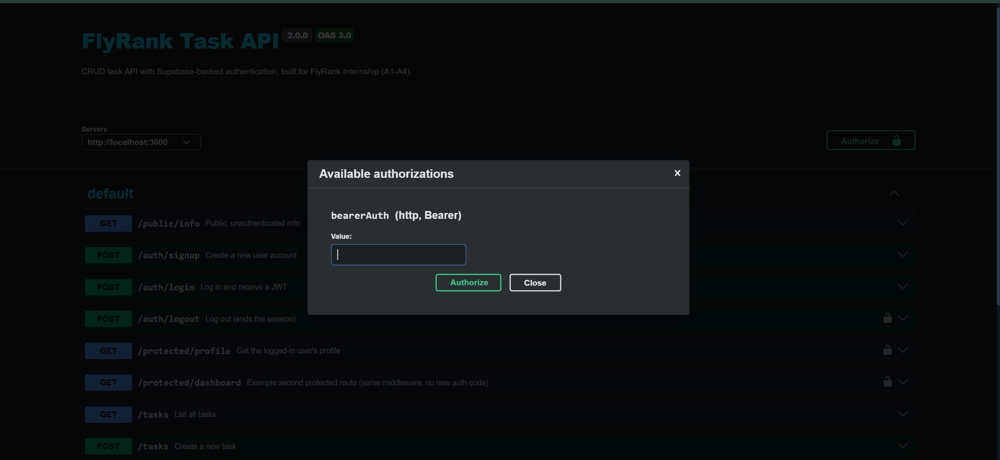
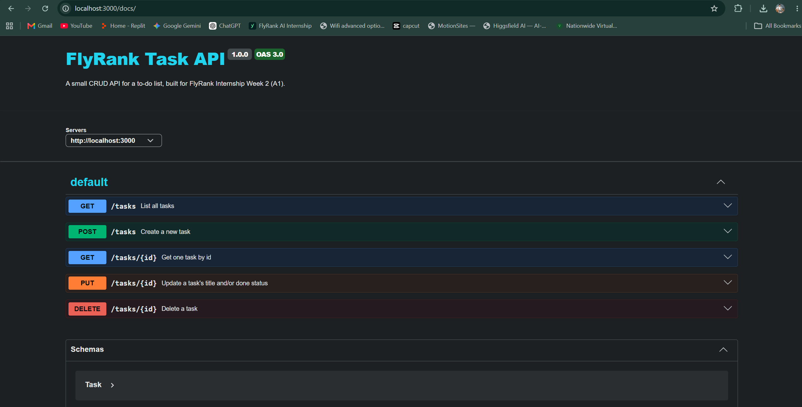

# FlyRank Tasks API — CRUD + SQLite + Supabase Auth (JavaScript / Express)

The full backend track project: a task API that started in-memory (A1),
moved its storage to SQLite (A2), and now has real user accounts and
protected routes via Supabase Auth (A4). Same repo, same lane,
growing across every assignment.

## What this project is

A small task API with real user accounts. `POST /auth/signup` and
`POST /auth/login` talk to [Supabase Auth](https://supabase.com/auth)
(your Identity Provider — it hashes passwords and signs tokens so this
code never has to). `GET /protected/profile` and
`GET /protected/dashboard` only answer for a request carrying a valid
token; `GET /public/info` answers anyone. The task CRUD endpoints
(`/tasks`, `/tasks/:id`, etc.) are unchanged from A1/A2 and are stored
in a SQLite file (`tasks.db`) that survives a server restart.

## Why SQLite (for the task storage)?

- **Single file.** The whole database is `tasks.db`, sitting next to
  the code. No server process to install, configure, or keep running.
- **Survives restarts.** Unlike a JS array, the file on disk doesn't
  disappear when the process stops.
- Right tool for a small, single-process app like this one. A team
  hammering the same database from many services concurrently would
  eventually reach for Postgres — but the API wouldn't need to change
  when that day comes, only the storage layer.

### Why `node:sqlite` instead of `better-sqlite3`

The assignment's suggested library is `better-sqlite3`, but it needs to
compile native code at install time (it downloads Node's C headers and
runs `node-gyp`). On a locked-down network that install can fail.

Since Node 22.5, there's a **built-in** SQLite module, `node:sqlite`.
It's the same idea as Python's `sqlite3` — already there, nothing to
`npm install` for the database part. It's marked experimental (you'll
see a one-line warning in the console), but it's fully functional and
avoids the native-compile step entirely.

## Setup: environment variables (for Supabase auth)

1. Create a free project at [supabase.com](https://supabase.com) (no
   card required).
2. In your Supabase dashboard: **Project Settings → API** → copy your
   **Project URL** and **anon public key**. (Never use the
   `service_role` key here — it bypasses all security.)
3. In your Supabase dashboard: **Authentication → Sign In / Providers →
   Email** → make sure Email is **enabled**, and turn **off** "Confirm
   email" so a fresh signup can log in immediately without a
   confirmation link. (In production you'd leave this on.)
4. Copy `.env.example` to `.env` and fill in your real values:
   ```
   SUPABASE_URL=your_project_url
   SUPABASE_KEY=your_anon_key
   PORT=3000
   ```
5. `.env` is git-ignored — it will never be committed. Only
   `.env.example` (placeholder values) is tracked.

## Where the task database lives

`tasks.db`, created automatically the first time the app starts. It's
git-ignored, so a fresh clone always starts from a clean, auto-seeded
database instead of shipping example data in the repo.

## Run it

```bash
npm install
npm start
```

You should see:
```
Server running and connected to Supabase (http://localhost:3000)
```
If instead you see `could NOT reach Supabase`, double-check your
`SUPABASE_URL`/`SUPABASE_KEY` — the server still starts and serves
requests either way, but auth routes won't work until that's fixed.

To run the automated checkpoint suites instead of testing by hand:
```bash
npm test          # CRUD/SQLite checkpoints (13 checks)
npm run test:auth # auth checkpoints that don't need a real Supabase project (9 checks)
```

## Endpoints

| Method | Path                    | Auth required?          | Notes |
|--------|-------------------------|--------------------------|-------|
| GET    | `/public/info`          | No                       | `{"message": "Welcome stranger! This info is public."}` |
| POST   | `/auth/signup`          | No                       | body: `{email, password}` → 201 + user, or 400 |
| POST   | `/auth/login`           | No                       | body: `{email, password}` → 200 + `access_token`/`refresh_token`, or 401 |
| POST   | `/auth/logout`          | **Yes** — `Bearer <token>` | 204 on success |
| GET    | `/protected/profile`    | **Yes** — `Bearer <token>` | 200 + `{id, email, created_at}`, or 401 |
| GET    | `/protected/dashboard`  | **Yes** — `Bearer <token>` | example second protected route, same middleware |
| GET    | `/tasks`                | No                       | supports `?search=`, `?done=`, `?sort=title` |
| GET    | `/tasks/:id`            | No                       | 404 + `{"error": "Task {id} not found"}` if missing |
| POST   | `/tasks`                | No                       | 400 on empty/missing title, else 201 |
| PUT    | `/tasks/:id`            | No                       | 404 if missing, else 200 with updated task |
| DELETE | `/tasks/:id`            | No                       | 204 on success; 404 if missing |
| GET    | `/stats`                | No                       | `{"total": n, "done": n, "open": n}` (extra) |
| POST   | `/reset`                | No                       | restores the 3 example tasks (extra) |
| GET    | `/docs`                 | No                       | Swagger UI, FlyRank-themed, with a bearer "Authorize" padlock |

All SQL queries use `?` parameterized placeholders — no request value
is ever glued into a SQL string.

## Example curl flow (auth)

```bash
# 1. Sign up
curl -i -X POST http://localhost:3000/auth/signup \
  -H "Content-Type: application/json" \
  -d '{"email":"test@example.com","password":"password123"}'
# -> 201 + user object

# 2. Log in
curl -i -X POST http://localhost:3000/auth/login \
  -H "Content-Type: application/json" \
  -d '{"email":"test@example.com","password":"password123"}'
# -> 200 + { "access_token": "...", "refresh_token": "...", "user": {...} }

# 3. Call a protected route with the token
curl -i http://localhost:3000/protected/profile \
  -H "Authorization: Bearer <PASTE_ACCESS_TOKEN_HERE>"
# -> 200 + { "id": "...", "email": "test@example.com", "created_at": "..." }

# 4. Tamper with the token (change one character) and try again
curl -i http://localhost:3000/protected/profile \
  -H "Authorization: Bearer <TAMPERED_TOKEN>"
# -> 401 { "error": "Invalid or expired token" }

# 5. Log out
curl -i -X POST http://localhost:3000/auth/logout \
  -H "Authorization: Bearer <PASTE_ACCESS_TOKEN_HERE>"
# -> 204
```

## Stage 4 (A2) — SQL by hand

Opened `tasks.db` directly (in DB Browser for SQLite — screenshot
below) and ran these queries, then confirmed the running API's
`GET /tasks` reflected each change immediately with no restart, because
the API and DB Browser read the exact same file:

```sql
SELECT * FROM tasks;                     -- 3 rows: Buy milk, Write report, Walk the dog
SELECT * FROM tasks WHERE done = 1;      -- 1 row: Walk the dog
SELECT COUNT(*) FROM tasks;              -- 3
UPDATE tasks SET done = 1;               -- marks all 3 tasks done
DELETE FROM tasks WHERE done = 1;        -- clears the table
```

**Example query and what it returned:** `SELECT * FROM tasks WHERE done = 1;`
returned exactly one row — `(3, 'Walk the dog', 1)` — proving the
`WHERE` clause filters at the database level, not in application code.


## Swagger UI (A4 — auth)

`GET /docs` shows a lock icon next to `/auth/logout`, `/protected/profile`,
and `/protected/dashboard`. Click **Authorize** (top right), paste an
access token from `/auth/login`, and every protected "Try it out" call
sends it automatically — no need to paste it into each request.



Earlier Swagger screenshot from A1/A2 (before auth was added):



## The reusable middleware

`middleware/authGuard.js` extracts the token, asks Supabase to verify
it (`supabase.auth.getUser(token)` — a real network call, so a forged
or tampered token is actually caught, not just pattern-matched), and
attaches the verified user to `req.user`. `/protected/profile`,
`/protected/dashboard`, and `/auth/logout` all use the exact same
middleware — adding a third protected route would take one line
(`app.get('/whatever', requireAuth, handler)`), no new auth code.

## Proof the API didn't change (A1 → A2 → A4)

The same `curl` commands and Swagger UI "Try it out" clicks from A1
still pass unchanged against every later version — same routes, same
request/response shapes, same status codes for the task CRUD
endpoints. That's the proof that storage and auth are each just an
implementation detail layered on top: clients never needed to know
whether task data lived in a JS array or a SQLite file, and the task
routes themselves never needed to know that auth was added elsewhere
in the app.

## Status codes

| Code | When |
|------|------|
| 201  | Signup succeeds; a task is created |
| 200  | Login succeeds; a protected route or task route returns data |
| 204  | Logout succeeds; a task is deleted |
| 400  | Missing email/password on signup/login; invalid task body |
| 401  | Missing token, malformed header, or invalid/expired/tampered token |
| 404  | Unknown task id |

## Extras built

- **Search/filter/sort on tasks:** `?search=`, `?done=`, `?sort=title`
- **Stats:** `GET /stats` computed with `SELECT COUNT(*)` in SQL
- **Reset:** `POST /reset` clears and re-seeds tasks via SQL, in a transaction
- **Index:** `CREATE INDEX idx_tasks_title ON tasks (title)`
- **Transactions:** the initial task seed and `POST /reset` both wrap
  their inserts in `BEGIN`/`COMMIT` (with `ROLLBACK` on error)

## Project structure

```
server.js                # Express app: CRUD + public/protected routes
lib/supabaseClient.js    # Shared Supabase client (anon key only)
middleware/authGuard.js  # requireAuth: verify bearer token, attach req.user
routes/auth.js           # /auth/signup, /auth/login, /auth/logout
openapi.json             # OpenAPI 3.0 spec incl. bearerAuth security scheme
swagger-theme.css        # Swagger UI theme
.env.example             # placeholder env vars (real .env is git-ignored)
test_checkpoints.js      # automated CRUD/SQLite checks
test_auth_checkpoints.js # automated auth checks (no real Supabase needed)
docs/                    # screenshots referenced above
```

## A note on testing this build

Signup, login, and real token verification all needed a live Supabase
project to actually run. This was tested end to end against a real
project: signup returned 201 with a real user object, login returned
200 with a real JWT, `/protected/profile` returned 200 with that token
and 401 with a tampered version of it, `/protected/dashboard` proved
the middleware is genuinely reusable, and `/auth/logout` returned 204.

## Checkpoints verified

**A1/A2 (CRUD + SQLite):**
- Restarted the server 3x on a fresh database: `GET /tasks` returned
  exactly 3 tasks every time — the seed never duplicated.
- `curl -i /tasks/999` → `404` + `{"error": "Task 999 not found"}`.
- Created a task via `POST`, restarted the server, `GET /tasks` still
  showed it — the first time data survived a restart.
- Full cycle: create → `PUT` to mark done → `DELETE`, confirming with
  `GET /tasks` after each step and correct status codes throughout.
- Edited `tasks.db` directly with raw SQL, then called the live API
  with no restart — same data, same file, no syncing step.
- A `?search=` value containing `' OR '1'='1` was treated as a literal
  string, not SQL — confirming parameterized placeholders work.

**A4 (auth):**
- `npm start` logs `Server running and connected to Supabase`.
- `.env` confirmed never committed (`git log` shows only `.env.example`).
- Real signup → 201, real login → 200 + JWT (verified against a live
  Supabase project).
- `GET /public/info` → 200. `GET /protected/profile` with no token → 401.
- Valid token → 200 with real user data; tampered token → 401.
- `GET /protected/dashboard` uses the identical middleware as
  `/protected/profile` — verified with the same real token.
- `POST /auth/logout` → 204 with a valid token.
- `/docs` shows the lock icon on all three protected routes.
